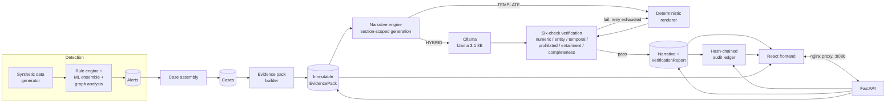

# SAR Copilot

Evidence-grounded narrative generation for AML Suspicious Activity Reports.

> Transaction monitoring tells you *that* something is suspicious.
> SAR Copilot tells you *how to write it down* — with every sentence
> traceable to a verified data field, and a hard refusal to emit
> anything it cannot ground.

Full specification: [`SAR-Copilot-Blueprint.md`](./SAR-Copilot-Blueprint.md).

**This is a complete, working demonstrator** — detection, evidence
assembly, GPU-backed narrative generation, a six-check verification
pipeline, a hash-chained audit ledger, and a full browser frontend, all
running via one `docker compose up -d`. See [Scope and
limitations](#scope-and-limitations) before assuming any part of this is
production-ready.

---

## Why this exists

A SAR narrative today is typically hand-written by an analyst against a
regulatory deadline, under real time pressure, describing evidence spread
across a case management system, a core banking platform, and a
transaction monitoring tool. The gaps this produces — inconsistent
narrative quality between analysts, backlog against filing deadlines, no
systematic way to verify a draft's factual claims before it ships — are
well documented in the compliance literature (blueprint §3). Large
language models are an obvious fit for the *drafting* half of this
problem and a genuinely dangerous fit for it unsupervised: a fluent,
confident, wrong narrative is worse than no narrative, because it's more
likely to be trusted. This project's actual thesis is that the
generation step is not the hard part — **verifying the generation step
is**, and that's where most of the engineering here actually went (see
[MODEL_CARD.md](./MODEL_CARD.md) §3 and [LIMITATIONS.md](./LIMITATIONS.md)).

## Architecture



Seven services on one Docker network (`nginx`, `web`, `api`, `postgres`,
`redis`, `ollama`, plus the entailment model loaded in-process by `api`)
— full detail in blueprint §9 and §21.

## The guarantee

Every narrative — regardless of generation mode — passes through **six
independent checks** before it's usable: numeric grounding, entity
grounding, temporal grounding, prohibited content, semantic entailment,
and section completeness. A single CRITICAL-severity failure blocks
release regardless of the weighted score — there is no averaging away a
fabricated account number. HYBRID mode retries against genuine
verification failures up to three times, then **deterministically falls
back to a template rendered entirely from evidence pack values** — the
system never ships an unverified draft, it ships a boring, safe one
instead.

This isn't an assertion — it's a measured result, including where it
doesn't hold up as cleanly as the pitch above suggests. See
[EVALUATION.md](./EVALUATION.md) for the real numbers, run against real
seeded cases and a hand-crafted ten-case adversarial suite, including the
finding that TEMPLATE mode's own numeric check has a real gap on
percentage-bearing typologies (detailed in
[LIMITATIONS.md](./LIMITATIONS.md)).

## Results

See [EVALUATION.md](./EVALUATION.md) for the full evaluation record:
TEMPLATE vs. HYBRID vs. FREEFORM on real cases, the ten-case adversarial
confusion matrix, and a 500-account detection evaluation. Headline
numbers reproduced there with exact `N`, dates, and the scripts that
produced them — nothing in that document is a projected or blueprint-
illustrative figure.

## Quick start

```bash
git clone <this repo>
cd sar-copilot
cp .env.example .env
docker compose up -d --build
```

First boot pulls the Llama 3.1 8B model inside the `ollama` container
(several GB — the `api` service does not block on this, so the app comes
up immediately and HYBRID-mode generation works once the pull finishes).
Everything else — Postgres schema via Alembic, a demo dataset, the
`api`/`web`/`nginx` services — comes up automatically.

```bash
open http://localhost:8080          # the app
curl  http://localhost:8080/health  # backend health, through the proxy
```

Or via `make` (see [`Makefile`](./Makefile) for the full target list,
including `make eval-modes`, `make eval-detection`, and `make
eval-adversarial-real` to reproduce every number in EVALUATION.md):

```bash
make up
```

### Explore it

No login system exists in this build (see [Scope and
limitations](#scope-and-limitations)) — there's nothing to sign in as.
Open the Case Queue at `http://localhost:8080/` and pick any case; a few
specific ones worth looking at:

- **CASE-0005** (Michael Brooks) — HIGH band, 0.934, two typologies
  (circular flow + deviation from declared profile). Good first case to
  open.
- **CASE-0003** (Ashley Dyer) — HIGH band, 0.894, four typologies
  including circular flow and rapid movement — already has multiple
  narrative versions in the seeded data, so the Version Diff screen has
  something real to show.
- **CASE-0001** (Underwood LLC) — a business account, HIGH band, good
  contrast against the individual-subject cases above.

From any case workspace: hover a sentence to see the trace interaction,
click a failed verification check to open Verification Detail, or click
**Audit trail** to see the hash-chained ledger (and its live
`POST /audit/verify-chain` re-check). The Quality Metrics screen
(linked from the Case Queue header) shows the same aggregate numbers
`EVALUATION.md` reports, live against whatever's currently in the
database. See [`docs/demo_script.md`](./docs/demo_script.md) for a full
walkthrough.

## Scope and limitations

This is a demonstrator built on **synthetic data only**. It does not
file to FinCEN or any regulator, has not been validated against real
SAR filings, and must never be used with real customer data. There is no
authentication/authorization system — every API call runs as an
unauthenticated "analyst" role (`app/deps.py`'s `get_current_user` stub)
— and no review/sign-off workflow beyond narrative generation and
editing. Full detail: [MODEL_CARD.md](./MODEL_CARD.md) and
[LIMITATIONS.md](./LIMITATIONS.md) — read the latter before trusting any
specific number in this repository.

## Licence

MIT — see [`LICENSE`](./LICENSE).
