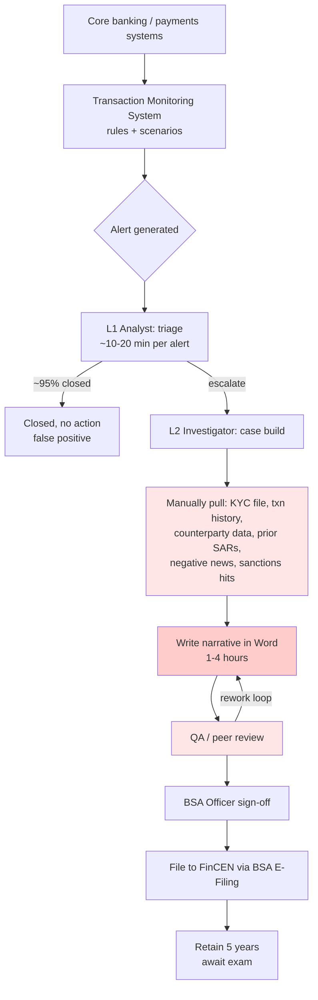
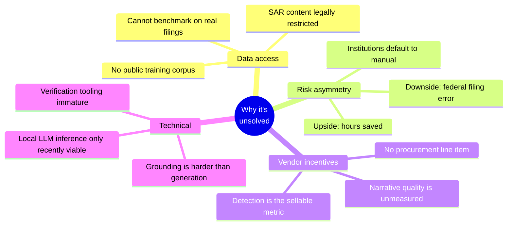
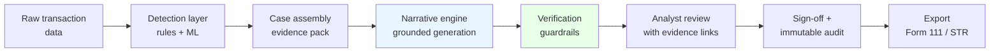
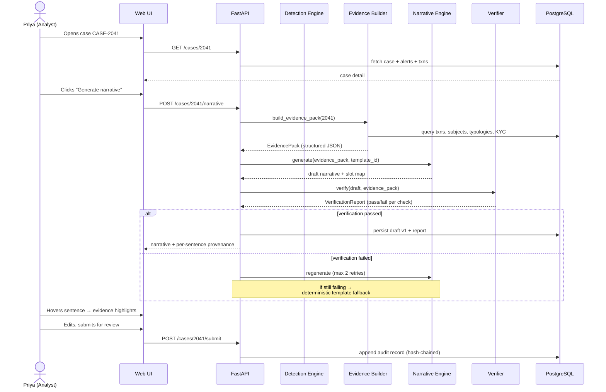
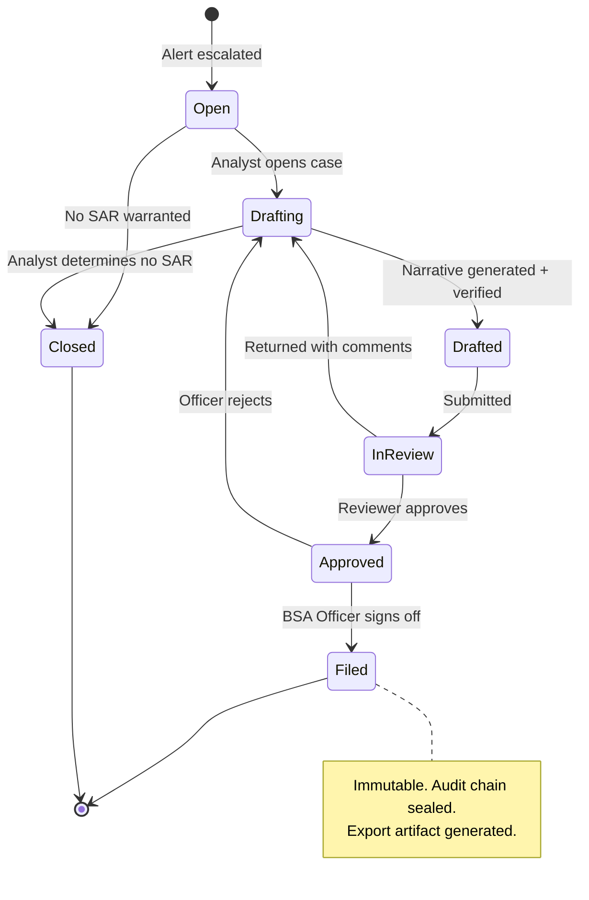
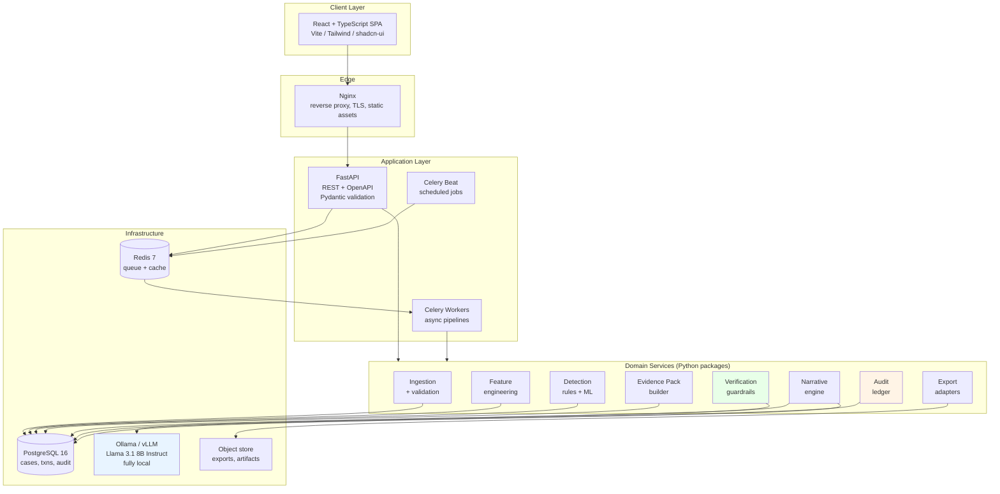
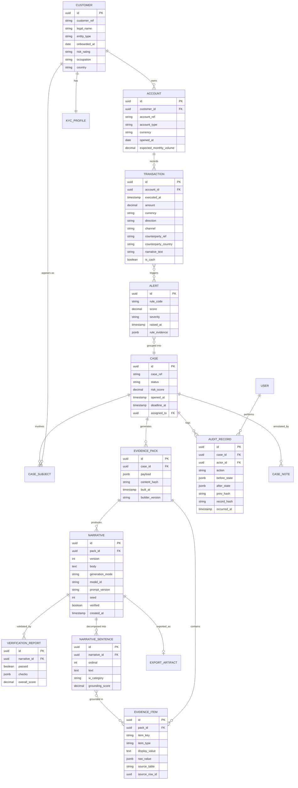
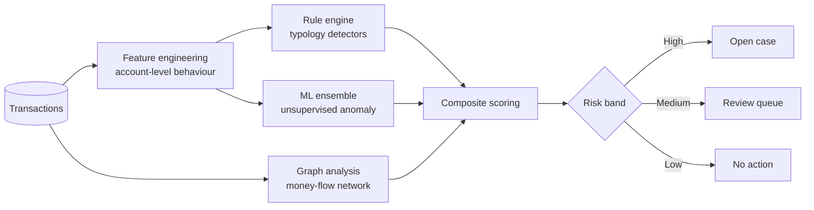

# SAR Copilot
### An Evidence-Grounded Narrative Generation System for AML Compliance
**Complete Build Blueprint — Architecture, Design, and Implementation Guide**

> Note on this file: this is the full project specification as provided at
> kickoff, saved here as the persistent in-repo source of truth that each
> build phase ("Part 1", "Part 2", ...) is scoped against. Section numbers
> referenced in code comments and commit messages (e.g. "per §10.3") refer
> to the numbering below.

---

> **One-line pitch:** Transaction monitoring systems tell analysts *that* something is suspicious. SAR Copilot tells them *how to write it down* — generating regulator-ready Suspicious Activity Report narratives where every single sentence is traceable back to a verified data field, with zero hallucination tolerance.

---

## Table of Contents

**PART A — The Problem Space**
1. What a SAR actually is
2. The compliance workflow today
3. Industry gaps — where the money and time are lost
4. Why nobody has solved this well yet
5. Competitive landscape

**PART B — The Product**
6. Product definition and scope
7. User personas
8. Core user journeys

**PART C — Technical Architecture**
9. System architecture
10. Data model
11. Backend design
12. The detection layer (ML)
13. The narrative engine (the crown jewel)
14. The hallucination guardrail pipeline
15. Audit and immutability layer

**PART D — Frontend**
16. Design direction
17. Design tokens
18. Screen-by-screen specification
19. Component architecture

**PART E — Build & Ship**
20. Repository structure
21. Docker architecture
22. Week-by-week build plan
23. Evaluation methodology
24. README / demo script

**PART F — Context**
25. Course module mapping
26. Limitations, risks, and ethics
27. Extension roadmap

---
---

# PART A — THE PROBLEM SPACE

## 1. What a SAR actually is

A **Suspicious Activity Report (SAR)** is a regulatory filing that a financial institution must submit when it detects a transaction or pattern it suspects involves money laundering, fraud, terrorist financing, or other financial crime.

### The legal skeleton (US)

| Element | Detail |
|---|---|
| **Governing law** | Bank Secrecy Act — 31 U.S.C. § 5318(g); implementing regs at 31 CFR Chapter X |
| **The form** | FinCEN Form 111 (the "SAR") |
| **Filed with** | FinCEN (Financial Crimes Enforcement Network), via the BSA E-Filing System |
| **Deadline** | 30 calendar days from initial detection of facts constituting a basis for filing. Extendable to 60 days if no suspect has been identified. |
| **Dollar thresholds (banks)** | ≥ $5,000 where a suspect can be identified; ≥ $25,000 regardless of whether a suspect is identified |
| **Confidentiality** | 31 U.S.C. § 5318(g)(2) — it is a **federal crime** to disclose the existence of a SAR to the subject ("tipping off") |
| **Retention** | 5 years from filing date |
| **Examination standard** | FFIEC BSA/AML Examination Manual |
| **Model governance** | SR 11-7 (Federal Reserve / OCC supervisory guidance on model risk management) |

### International equivalents

| Jurisdiction | Report name | Regulator / FIU | Framework |
|---|---|---|---|
| **India** | STR (Suspicious Transaction Report) | FIU-IND | Prevention of Money Laundering Act, 2002 |
| **EU** | STR / SAR | National FIUs (via goAML) | EU Anti-Money Laundering Directives |
| **UK** | SAR | National Crime Agency (NCA) | Proceeds of Crime Act 2002 |
| **Australia** | SMR | AUSTRAC | AML/CTF Act 2006 |

> **Design implication:** Because the *narrative* requirement is near-universal across jurisdictions (even where the form differs), the narrative engine is the portable, high-value component. Build the core jurisdiction-agnostic, with pluggable export adapters.

### The narrative is the hard part

The SAR form has structured fields (dates, amounts, account numbers, subject identifiers) — those are mechanical. Part V of the form is the **narrative**: free text where the analyst must explain, in prose, the suspicious activity.

FinCEN's guidance is that the narrative must answer **who, what, when, where, why, and how**:

```
WHO   — is conducting the suspicious activity? (subjects, roles, relationships)
WHAT  — instruments or mechanisms are being used? (wires, cash, ACH, crypto)
WHEN  — did it take place? (date range, sequencing, velocity)
WHERE — did it take place? (branches, jurisdictions, counterparties)
WHY   — is the activity suspicious? (typology, deviation from expected profile)
HOW   — did the activity occur? (the mechanics, step by step)
```

A weak narrative is a compliance failure even if the detection was correct. Regulators have issued consent orders and civil money penalties against institutions specifically for narratives that were incomplete, templated, or failed to explain the suspicion.

**This is the crux: the detection problem is well-served by vendors. The articulation problem is not.**

---

## 2. The compliance workflow today



The red-shaded steps are where SAR Copilot intervenes. Note that they are **not** the detection steps — they are the evidence-assembly and articulation steps.

### Time allocation reality

Industry-reported figures (verify and cite in your README — these are commonly quoted but vary by institution):

| Metric | Commonly reported range |
|---|---|
| Transaction monitoring false positive rate | 90–95%+ |
| Alert-to-SAR conversion rate | low single-digit % |
| Analyst time to draft one SAR narrative | 1–4 hours |
| Share of investigator time spent on evidence gathering + writing vs. actual analysis | Majority on the former |
| SARs filed with FinCEN annually (all filer types) | Several million |

> ⚠️ **Accuracy note for your report:** Do not state these as hard facts without citation. Source them from FinCEN's published SAR Stats, ACAMS surveys, or vendor whitepapers, and cite explicitly. Overstating industry statistics is the fastest way to lose credibility in a viva or interview.

---

## 3. Industry gaps — where the money and time are lost

This is the section that justifies the product's existence. Six concrete gaps:

### Gap 1 — Vendors optimize detection, not documentation

The AML software market (NICE Actimize, Oracle Financial Crime & Compliance, SAS, Verafin, Featurespace, ComplyAdvantage, Hawk AI, Unit21) is overwhelmingly focused on:
- Better scenario rules
- Fewer false positives
- Entity resolution and network analytics

The narrative-writing step is typically a **free-text box in a case management UI**. Some vendors offer template insertion; almost none offer grounded generation with verification. The workflow's most labour-intensive step is its least automated.

### Gap 2 — Narrative quality is inconsistent and unauditable

Two analysts looking at the same case produce materially different narratives. There is no systematic way to answer:
- *Did this narrative include every material fact in the case file?*
- *Is every assertion in this narrative supported by evidence?*
- *Does this narrative meet the 5W1H standard?*

Institutions handle this with manual QA sampling — expensive, slow, and statistically weak.

### Gap 3 — LLMs are the obvious tool, but are blocked by four hard constraints

Every bank has considered "just use GPT for this." They stop at:

| Blocker | Why it kills naive LLM adoption |
|---|---|
| **Confidentiality** | SAR content is legally restricted. Sending it to a third-party API is, at minimum, a policy violation and potentially a disclosure breach. |
| **Hallucination** | A fabricated amount, date, or account number in a federal filing is a regulatory catastrophe, not a UX annoyance. |
| **Auditability** | Under SR 11-7, a model influencing regulatory output needs documented validation, monitoring, and explainability. "The LLM wrote it" is not a defensible answer to an examiner. |
| **Non-determinism** | Same case, different narrative on each run. Examiners dislike processes that aren't reproducible. |

**Every one of these is an engineering problem with an engineering answer.** That is the product.

### Gap 4 — Evidence assembly is manual and repetitive

Building the case file means pulling from KYC systems, transaction stores, prior SAR archives, sanctions/PEP screening, and negative news — usually by hand, usually into a Word document. This is deterministic data retrieval being done by humans.

### Gap 5 — No open reference implementation exists

There is no credible open-source project demonstrating grounded, verifiable SAR narrative generation. Detection projects are abundant; this niche is empty. **For a portfolio, that's the whole point.**

### Gap 6 — Regulatory feedback loops are broken

Institutions rarely learn which SARs were useful to law enforcement. Without labels, narrative quality can't be optimised on outcomes. A system that captures structured quality signals at least creates the substrate for that loop.

---

## 4. Why nobody has solved this well yet



The technical blocker — running a capable language model entirely on-premises with acceptable latency — dissolved roughly in the last two years. That is the opening.

---

## 5. Competitive landscape

| Player | What they do | Gap they leave |
|---|---|---|
| NICE Actimize, Oracle, SAS | Enterprise transaction monitoring + case management | Narrative is a text box; no grounded generation |
| Verafin, Unit21, Hawk AI | Modern cloud AML platforms, better UX | Narrative assistance is templated at best |
| ComplyAdvantage, Sardine | Screening, risk scoring | Not in the SAR filing workflow |
| Generic LLM copilots | Draft anything | No grounding, no verification, no audit trail, confidentiality-blocking |
| **SAR Copilot** | Grounded narrative generation + verification + audit | — |

**Positioning statement:**
> *SAR Copilot is not a detection tool and not a chatbot. It is a verification-first narrative compiler that turns a structured case file into a regulator-ready narrative, and refuses to emit any sentence it cannot trace to evidence.*

---
---

# PART B — THE PRODUCT

## 6. Product definition and scope

### What it does



### In scope (v1)

- Synthetic transaction data generator with injected laundering typologies
- Rule-based typology detection (structuring, layering, velocity, round-tripping, high-risk geography)
- Unsupervised ML anomaly scoring (Isolation Forest + LOF + Mahalanobis ensemble)
- Automated case assembly into a structured **Evidence Pack**
- Grounded narrative generation via locally-hosted LLM
- Multi-stage verification pipeline (numeric, entity, temporal, semantic, completeness)
- Deterministic template fallback when generation fails verification
- Analyst review UI with sentence-to-evidence traceability
- Role-based workflow (Analyst → Reviewer → BSA Officer)
- Hash-chained immutable audit log
- Export to FinCEN Form 111 structured format + PDF
- Full Docker Compose deployment

### Explicitly out of scope (v1) — state this in your README

- Real customer data of any kind
- Actual filing to FinCEN or any regulator
- Production-grade entity resolution
- Sanctions/PEP screening (stubbed with mock lists)
- Multi-tenancy / enterprise SSO
- Real-time streaming ingestion (batch only)

> Declaring scope boundaries explicitly is itself a compliance-minded signal. It shows you understand the difference between a demonstrator and a regulated system.

---

## 7. User personas

### Persona 1 — Priya, L2 AML Investigator
- **Context:** Handles 8–15 escalated cases per week. Deep domain knowledge, moderate technical skill.
- **Pain:** Spends more time formatting Word documents and hunting for account details than analysing patterns.
- **Needs:** Speed, accuracy, and the ability to *edit* rather than *author*.
- **Success:** Case-to-draft in under 60 seconds; she edits rather than writes.
- **Fear:** Being blamed for an error the machine introduced. → *Product must make provenance obvious.*

### Persona 2 — Marcus, QA Reviewer
- **Context:** Reviews narratives before officer sign-off. Checks completeness and defensibility.
- **Pain:** No systematic way to verify a narrative covers all material facts.
- **Needs:** A checklist view — what's covered, what's missing, what's unsupported.
- **Success:** Review time drops because the system pre-flags gaps.

### Persona 3 — Anita, BSA Officer
- **Context:** Legally accountable for filings. Signs off. Faces examiners.
- **Pain:** Must defend process quality to regulators with limited evidence.
- **Needs:** Audit trail, consistency metrics, model documentation.
- **Success:** Can hand an examiner a complete lineage for any filing.
- **Fear:** An unexplainable model in the filing chain. → *Product must be explainable end to end.*

### Persona 4 — Dev, Model Risk / Validation
- **Context:** Validates models under SR 11-7.
- **Needs:** Deterministic reproducibility, versioned prompts, evaluation metrics, drift monitoring.
- **Success:** Can reproduce any historical narrative from its stored inputs and version pins.

---

## 8. Core user journeys

### Journey A — Draft a narrative (the primary loop)



### Journey B — Review and sign-off



Every transition writes an audit record. No state can be reached without one.

---
---

# PART C — TECHNICAL ARCHITECTURE

## 9. System architecture

### 9.1 High-level architecture



### 9.2 The architectural thesis

Three principles drive every decision below. State these prominently in your README:

> **P1 — Nothing leaves the perimeter.**
> The LLM runs locally. No external API calls in the data path. This is not a preference; it is what makes the product legally deployable.

> **P2 — Generation is untrusted; verification is trusted.**
> The language model is treated as an *adversarial component*. Its output is a proposal, not a result. Nothing reaches a human without passing deterministic verification.

> **P3 — Every output is reproducible.**
> Same evidence pack + same prompt version + same model version + same seed → same narrative. Non-determinism is a bug, not a feature.

### 9.3 Technology decisions with justification

| Layer | Choice | Why this and not the alternative |
|---|---|---|
| **API framework** | FastAPI | Async-native (needed for LLM streaming), automatic OpenAPI docs (audit artifact), Pydantic gives schema validation as a first-class primitive — critical when your whole thesis is structured evidence. Django is heavier and ORM-coupled; Flask lacks async and typing ergonomics. |
| **Language** | Python 3.11+ | The ML ecosystem is non-negotiable here. 3.11+ for performance and better typing. |
| **Database** | PostgreSQL 16 | Needs: ACID (audit integrity), JSONB (evidence packs are semi-structured), window functions (velocity/behavioural features), full-text search, and `pgvector` if you extend to semantic retrieval. MongoDB loses transactional guarantees you need for an audit ledger. |
| **ORM / migrations** | SQLAlchemy 2.0 + Alembic | Versioned schema migrations are themselves a compliance artifact. |
| **Queue** | Celery + Redis | Narrative generation takes 5–30s. It must be async or the UI blocks. Redis doubles as cache. RabbitMQ is more robust but heavier for this scale. |
| **LLM runtime** | Ollama (dev) / vLLM (scale) | Ollama: trivial Docker deployment, single binary, good enough throughput for demo. vLLM: production throughput via paged attention. Both fully local. |
| **Model** | Llama 3.1 8B Instruct (or Mistral 7B Instruct) | Fits in ~6–8 GB quantised, runs on CPU acceptably and well on modest GPU. Good instruction following. **Critically: open weights = you can pin the version, which SR 11-7 effectively requires.** |
| **Classical ML** | scikit-learn | Isolation Forest, LOF, StandardScaler, Mahalanobis. Interpretable, fast, no GPU, and — importantly — *explainable to a regulator*. Deep learning here would be a liability, not an asset. |
| **Graph analysis** | NetworkX | Money-flow cycles, fan-in/fan-out, betweenness. Pure Python, no infra. Neo4j is overkill below millions of edges. |
| **Frontend** | React 18 + TypeScript + Vite | TypeScript is essential — the evidence-pack schema must be typed end-to-end or provenance breaks silently. Vite for fast DX. |
| **UI components** | Tailwind + shadcn/ui + Radix | Accessible primitives, no runtime CSS-in-JS cost, full control over visual identity (see Part D). |
| **Data fetching** | TanStack Query | Caching, background refetch, optimistic updates for the review workflow. |
| **Charts** | Recharts | Declarative, React-native, sufficient for the analytics views. |
| **Graph viz** | React Flow | The money-flow network view. Interactive, pannable, custom nodes. |
| **Testing** | pytest + Vitest + Playwright | Unit, component, and one end-to-end journey test. |
| **Containers** | Docker Compose | Seven services, reproducible, single `docker compose up`. |

---

## 10. Data model

### 10.1 Entity relationship diagram



### 10.2 The Evidence Pack — the central abstraction

Everything hinges on this object. It is the **only** thing the language model ever sees.

```python
# app/domain/evidence/schema.py
from pydantic import BaseModel, Field
from decimal import Decimal
from datetime import datetime, date
from typing import Literal
from uuid import UUID

class EvidenceItem(BaseModel):
    """An atomic, verifiable fact. Every narrative claim maps to one of these."""
    key: str                      # "subject.primary.name"
    type: Literal["entity", "amount", "date", "count",
                  "location", "channel", "typology", "text"]
    display_value: str            # "Rajesh Mehta" — exact string allowed in narrative
    raw_value: dict               # {"first": "Rajesh", "last": "Mehta"}
    source_table: str             # "customer"
    source_row_id: UUID
    source_field: str             # "legal_name"
    confidence: float = 1.0       # 1.0 for direct DB reads

class SubjectEvidence(BaseModel):
    customer_ref: str
    legal_name: str
    entity_type: str
    role: Literal["primary", "counterparty", "beneficiary", "originator"]
    account_refs: list[str]
    occupation: str | None
    country: str
    risk_rating: str
    relationship_start: date
    expected_monthly_volume: Decimal
    observed_monthly_volume: Decimal

class TransactionEvidence(BaseModel):
    txn_ref: str
    executed_at: datetime
    amount: Decimal
    currency: str
    direction: Literal["credit", "debit"]
    channel: str
    counterparty_ref: str | None
    counterparty_country: str | None
    is_cash: bool
    flagged_by: list[str]         # rule codes

class TypologyEvidence(BaseModel):
    code: str                     # "STRUCTURING"
    label: str                    # "Structuring / smurfing"
    description: str              # deterministic, from a curated dictionary
    weight: float
    supporting_txn_refs: list[str]
    quantitative_basis: dict      # {"txn_count": 14, "total": "128500.00"}

class AggregateEvidence(BaseModel):
    period_start: date
    period_end: date
    total_credit: Decimal
    total_debit: Decimal
    txn_count: int
    cash_txn_count: int
    distinct_counterparties: int
    distinct_countries: list[str]
    max_single_amount: Decimal
    velocity_peak_24h: int
    deviation_from_expected: Decimal   # multiple of expected volume

class EvidencePack(BaseModel):
    """Immutable, hashed, versioned. The LLM's ONLY input."""
    pack_id: UUID
    case_ref: str
    built_at: datetime
    builder_version: str
    content_hash: str

    subjects: list[SubjectEvidence]
    transactions: list[TransactionEvidence]
    typologies: list[TypologyEvidence]
    aggregates: AggregateEvidence
    ml_findings: dict              # anomaly scores + top deviating features
    graph_findings: dict           # cycles, hubs, betweenness
    prior_sars: list[dict]
    items: list[EvidenceItem]      # flattened index for verification

    def allowed_entities(self) -> set[str]:
        """Every proper noun the narrative may legally contain."""
        return {i.display_value for i in self.items if i.type in ("entity", "location")}

    def allowed_numbers(self) -> set[str]:
        """Every numeric token the narrative may legally contain."""
        return {i.display_value for i in self.items if i.type in ("amount", "count")}

    def allowed_dates(self) -> set[str]:
        return {i.display_value for i in self.items if i.type == "date"}
```

**Why this design matters:** the verification layer in §14 is only possible because every permissible token is enumerable in advance. If you skip the `EvidenceItem` flattening, you cannot verify. This is the single most important structural decision in the system.

### 10.3 Key indexes

```sql
CREATE INDEX idx_txn_account_time  ON transaction (account_id, executed_at DESC);
CREATE INDEX idx_txn_amount        ON transaction (amount)
    WHERE amount BETWEEN 8000 AND 10000;              -- structuring hot path
CREATE INDEX idx_alert_case        ON alert (case_id, raised_at DESC);
CREATE INDEX idx_case_status       ON "case" (status, deadline_at);
CREATE INDEX idx_audit_chain       ON audit_record (case_id, occurred_at);
CREATE INDEX idx_evidence_pack_gin ON evidence_pack USING GIN (payload jsonb_path_ops);
```

---

## 11. Backend design

### 11.1 Package layout

```
app/
├── main.py                    # FastAPI app factory, middleware, routers
├── config.py                  # pydantic-settings, env-driven
├── deps.py                    # DI: db session, current_user, rbac guards
│
├── api/v1/
│   ├── cases.py               # case CRUD, workflow transitions
│   ├── narratives.py          # generate, revise, verify, diff
│   ├── evidence.py            # pack retrieval, item lookup
│   ├── detection.py           # trigger runs, view alerts
│   ├── exports.py             # Form 111 XML, PDF
│   ├── audit.py               # audit trail + chain verification
│   └── auth.py                # login, token refresh
│
├── domain/
│   ├── ingestion/             # loaders, validators, synthetic generator
│   ├── features/              # behavioural feature engineering
│   ├── detection/
│   │   ├── rules.py           # typology rule engine
│   │   ├── ml.py              # IsolationForest + LOF + Mahalanobis
│   │   ├── graph.py           # NetworkX money-flow analysis
│   │   └── scoring.py         # composite risk score + banding
│   ├── evidence/
│   │   ├── schema.py          # Pydantic models above
│   │   └── builder.py         # case → EvidencePack
│   ├── narrative/
│   │   ├── engine.py          # orchestration + retry
│   │   ├── prompts/           # versioned prompt templates
│   │   ├── llm_client.py      # Ollama/vLLM adapter
│   │   └── deterministic.py   # template fallback generator
│   ├── verification/
│   │   ├── numeric.py
│   │   ├── entity.py
│   │   ├── temporal.py
│   │   ├── semantic.py
│   │   ├── completeness.py
│   │   ├── prohibited.py
│   │   └── pipeline.py        # runs all checks, aggregates
│   ├── audit/
│   │   └── ledger.py          # hash-chained append-only writer
│   └── export/
│       ├── fincen_111.py
│       └── pdf.py
│
├── models/                    # SQLAlchemy ORM
├── schemas/                   # API request/response Pydantic
├── workers/                   # Celery tasks
└── tests/
```

### 11.2 API surface

| Method | Path | Purpose | Role |
|---|---|---|---|
| `POST` | `/api/v1/auth/login` | JWT issue | public |
| `GET` | `/api/v1/cases` | List with filters (status, risk band, deadline) | analyst+ |
| `GET` | `/api/v1/cases/{id}` | Full case detail | analyst+ |
| `POST` | `/api/v1/cases/{id}/transition` | Workflow state change | role-gated |
| `GET` | `/api/v1/cases/{id}/evidence` | Retrieve evidence pack | analyst+ |
| `POST` | `/api/v1/cases/{id}/evidence/rebuild` | Force rebuild | analyst+ |
| `POST` | `/api/v1/cases/{id}/narrative` | **Generate** (async → task id) | analyst+ |
| `GET` | `/api/v1/narratives/{id}` | Narrative + sentence provenance | analyst+ |
| `PATCH` | `/api/v1/narratives/{id}` | Analyst edit (creates new version) | analyst+ |
| `POST` | `/api/v1/narratives/{id}/verify` | Re-run verification on edited text | analyst+ |
| `GET` | `/api/v1/narratives/{id}/diff/{v}` | Version diff | reviewer+ |
| `POST` | `/api/v1/detection/run` | Trigger detection batch | admin |
| `GET` | `/api/v1/audit/case/{id}` | Audit trail | reviewer+ |
| `POST` | `/api/v1/audit/verify-chain` | Validate hash chain integrity | officer+ |
| `GET` | `/api/v1/exports/{narrative_id}/form111` | Structured export | officer+ |
| `GET` | `/api/v1/metrics/quality` | Narrative quality dashboard data | reviewer+ |

### 11.3 RBAC matrix

| Action | Analyst | Reviewer | BSA Officer | Admin |
|---|:--:|:--:|:--:|:--:|
| View case | Y | Y | Y | Y |
| Generate narrative | Y | Y | Y | Y |
| Edit narrative | Y | Y | Y | N |
| Submit for review | Y | Y | Y | N |
| Approve narrative | N | Y | Y | N |
| Sign off / file | N | N | Y | N |
| View audit chain | N | Y | Y | Y |
| Verify chain integrity | N | N | Y | Y |
| Run detection batch | N | N | N | Y |

Enforced as FastAPI dependencies, not in the UI. The UI hides what it can; the API refuses what it must.

---

## 12. The detection layer (ML)

This is what makes the project *AI for cybersecurity* rather than an LLM wrapper. Three parallel signals converge into a composite risk score.



### 12.1 Feature engineering

Account-level behavioural features computed over a rolling window:

```python
FEATURES = [
    "txn_count_30d",
    "total_credit_30d", "total_debit_30d",
    "net_flow_30d",
    "mean_amount", "std_amount", "max_amount",
    "cash_ratio",                    # cash txns / total txns
    "round_amount_ratio",            # amounts ending in 000
    "sub_threshold_ratio",           # amounts in [0.85*T, T)
    "distinct_counterparties",
    "counterparty_concentration",    # Herfindahl index
    "distinct_countries",
    "high_risk_country_ratio",
    "night_txn_ratio",               # 00:00-05:00 local
    "weekend_txn_ratio",
    "velocity_max_24h",
    "inter_txn_time_mean", "inter_txn_time_std",
    "volume_vs_expected_ratio",      # observed / KYC-declared
    "pass_through_ratio",            # debits within 48h of credits
    "balance_volatility",
]
```

> **Design note:** `volume_vs_expected_ratio` is the single most compliance-native feature. It encodes the core AML question — *is this customer behaving like they said they would?* Most generic anomaly-detection projects omit the KYC baseline entirely. Including it is a genuine differentiator.

### 12.2 Typology rule engine

Deterministic detectors, each emitting a weighted, **human-readable reason code**. Rules are auditable in a way ML is not — this is why regulators still require them.

| Code | Typology | Detection logic (illustrative) |
|---|---|---|
| `STRUCTURING` | Deposits engineered below reporting threshold | ≥3 cash credits in [0.85T, T) within 7 days |
| `SMURFING` | Many small deposits from many parties into one account | ≥5 distinct originators, each < T, within 14 days |
| `RAPID_MOVEMENT` | Pass-through / layering | ≥70% of credited value debited within 48h |
| `CIRCULAR_FLOW` | Round-tripping | Directed cycle detected in money-flow graph, value retention > 60% |
| `HIGH_VELOCITY` | Burst activity | 24h txn count > μ + 3σ of account baseline |
| `CASH_INTENSIVE` | Cash disproportionate to profile | cash_ratio > 0.6 AND business type not cash-intensive |
| `CROSS_BORDER_RISK` | High-risk jurisdiction exposure | Any counterparty in configured high-risk list |
| `ROUND_AMOUNTS` | Unnatural amount patterns | round_amount_ratio > 0.5 with n ≥ 10 |
| `PROFILE_DEVIATION` | Volume far exceeds KYC expectation | volume_vs_expected_ratio > 5.0 |
| `DORMANT_REACTIVATION` | Sudden activity on dormant account | ≥180 days inactive, then > 10x historical mean |

Each fires an `Alert` carrying `rule_evidence` — the exact transaction refs and computed values that triggered it. **This becomes `TypologyEvidence` in the pack.**

### 12.3 ML anomaly ensemble

```python
# app/domain/detection/ml.py
from sklearn.ensemble import IsolationForest
from sklearn.neighbors import LocalOutlierFactor
from sklearn.covariance import MinCovDet
from sklearn.preprocessing import RobustScaler
import numpy as np

class AnomalyEnsemble:
    """
    Three complementary detectors. Averaged into one score.
    Chosen for interpretability — every component can be explained
    to a model validator without hand-waving.
    """
    def __init__(self, contamination: float = 0.02, seed: int = 42):
        self.scaler = RobustScaler()
        self.iforest = IsolationForest(
            n_estimators=300, contamination=contamination,
            random_state=seed, n_jobs=-1
        )
        self.lof = LocalOutlierFactor(
            n_neighbors=25, contamination=contamination, novelty=True
        )
        self.mcd = MinCovDet(random_state=seed)
        self.feature_names_: list[str] = []

    def fit(self, X: np.ndarray, feature_names: list[str]):
        self.feature_names_ = feature_names
        Xs = self.scaler.fit_transform(X)
        self.iforest.fit(Xs)
        self.lof.fit(Xs)
        self.mcd.fit(Xs)
        return self

    def score(self, X: np.ndarray) -> np.ndarray:
        """Returns anomaly score in [0,1]; higher = more anomalous."""
        Xs = self.scaler.transform(X)
        s_if  = -self.iforest.score_samples(Xs)
        s_lof = -self.lof.score_samples(Xs)
        s_mah = self.mcd.mahalanobis(Xs)
        norm = lambda v: (v - v.min()) / (v.ptp() + 1e-9)
        return (norm(s_if) + norm(s_lof) + norm(s_mah)) / 3.0

    def explain(self, x: np.ndarray, top_k: int = 5) -> list[dict]:
        """
        Per-account explanation: which features deviate most.
        Feeds ml_findings in the EvidencePack — so the narrative can say
        'transaction velocity was 4.2 standard deviations above baseline'
        and that claim is verifiable.
        """
        xs = self.scaler.transform(x.reshape(1, -1))[0]
        deviations = np.abs(xs)
        idx = np.argsort(deviations)[::-1][:top_k]
        return [
            {
                "feature": self.feature_names_[i],
                "z_score": round(float(xs[i]), 2),
                "raw_value": float(x[i]),
            }
            for i in idx
        ]
```

**Why not deep learning:** an autoencoder would work, but you would be unable to explain a specific score to a model validator. Under SR 11-7 that is a genuine deployment blocker. Choosing the interpretable model *on purpose*, and saying why, is a stronger answer than reaching for the fanciest architecture.

### 12.4 Graph analysis

```python
# app/domain/detection/graph.py
import networkx as nx

def build_flow_graph(transactions) -> nx.DiGraph:
    G = nx.DiGraph()
    for t in transactions:
        src, dst = t.originator_ref, t.beneficiary_ref
        if G.has_edge(src, dst):
            G[src][dst]["value"] += float(t.amount)
            G[src][dst]["count"] += 1
        else:
            G.add_edge(src, dst, value=float(t.amount), count=1)
    return G

def find_circular_flows(G, min_retention=0.6, max_len=6):
    """Round-tripping: value that returns to origin."""
    findings = []
    for cycle in nx.simple_cycles(G, length_bound=max_len):
        if len(cycle) < 3:
            continue
        vals = [G[cycle[i]][cycle[(i+1) % len(cycle)]]["value"]
                for i in range(len(cycle))]
        retention = min(vals) / max(vals) if max(vals) else 0
        if retention >= min_retention:
            findings.append({
                "type": "CIRCULAR_FLOW", "nodes": cycle,
                "retention": round(retention, 3),
                "min_value": min(vals), "hops": len(cycle),
            })
    return findings

def find_hubs(G, fan_threshold=8):
    """Collector (fan-in) and mule-distribution (fan-out) patterns."""
    out = []
    for n in G.nodes():
        fan_in, fan_out = G.in_degree(n), G.out_degree(n)
        if fan_in >= fan_threshold:
            out.append({"type": "FAN_IN", "node": n, "degree": fan_in})
        if fan_out >= fan_threshold:
            out.append({"type": "FAN_OUT", "node": n, "degree": fan_out})
    return out

def pass_through_score(G):
    """Betweenness → intermediaries in layering chains."""
    return nx.betweenness_centrality(G, weight="value")
```

### 12.5 Composite scoring

```python
COMPOSITE = (
    0.45 * rule_score      # typology weight sum, normalised
  + 0.35 * ml_score        # ensemble anomaly score
  + 0.20 * graph_score     # cycle/hub/betweenness contribution
)

BANDS = {
    (0.75, 1.00): "HIGH",     # auto-open case
    (0.50, 0.75): "MEDIUM",   # review queue
    (0.00, 0.50): "LOW",      # no action
}
```

Weights are configuration, not code, and are versioned — a model-governance requirement.

---

## 13. The narrative engine

This is the differentiating component. Read this section twice.

### 13.1 The core insight

Naive approach — and why it fails:

```
BAD:  case_data -> "Write a SAR narrative for this" -> LLM -> output
```

Failure modes: fabricated account numbers, invented amounts, hallucinated relationships, legal conclusions the institution must not assert, non-reproducible output, and no way to prove any of it wrong.

SAR Copilot's approach:

```
GOOD: case -> EvidencePack (enumerable facts)
           -> constrained generation (structured slots)
           -> deterministic verification (every token checked)
           -> provenance mapping (sentence -> evidence item)
           -> human review (with highlighting)
           -> immutable audit
```

The model is downgraded from *author* to *phrasing engine operating over a fixed fact set*.

### 13.2 Three generation modes

| Mode | Mechanism | Use when | Risk |
|---|---|---|---|
| **`TEMPLATE`** | Pure Jinja2 slot-filling from evidence pack | Fallback; high-assurance environments | Zero hallucination. Reads stiffly. |
| **`HYBRID`** *(default)* | LLM writes each 5W1H section independently, constrained to a slot schema; assembled deterministically | Normal operation | Very low. Section-scoped errors are contained. |
| **`FREEFORM`** | LLM drafts whole narrative from pack | Never in production; benchmark baseline only | Highest. Included to *demonstrate* why constrained generation matters. |

> Shipping all three, and evaluating them against each other (§23), is what turns this from a demo into a piece of engineering research. Your evaluation table will show FREEFORM failing verification at a materially higher rate — that chart is the single most persuasive artifact in the whole project.

### 13.3 The narrative structure

FinCEN's 5W1H, encoded as an ordered section schema (see original spec for the full `NARRATIVE_SECTIONS` structure: introduction, who, what_when, where, how, why, conclusion — each with required_evidence, max_sentences, and must_contain slots).

### 13.4 The prompt (versioned artifact)

Prompts are **versioned files in the repo**, hashed, and recorded against every generation. Under SR 11-7, an unversioned prompt is an unvalidated model input. See `app/domain/narrative/prompts/v1.0.0/` layout with `system.txt` and per-section prompt files plus a `registry.json` mapping version to hash and activation date.

The system prompt's absolute constraints (paraphrased): only state facts present in evidence; never introduce a number, name, date, account reference, location, or amount absent from evidence; never infer, estimate, extrapolate or round; never assert legal conclusions or guilt; never speculate about intent; never reference the AI/model/system by name; and if evidence is insufficient, output `INSUFFICIENT_EVIDENCE` rather than filling the gap. Output must be JSON: `{"sentences": [{"text": ..., "evidence_keys": [...]}]}`, and every sentence must cite at least one evidence key.

### 13.5 Engine orchestration

Section-scoped generation: each of the ordered sections is generated independently against only the evidence it needs, assembled deterministically, then verified as a whole. On verification failure, failed sections are regenerated with repair instructions (max 3 attempts) before falling back to the deterministic template — never releasing an unverified narrative.

### 13.6 Deterministic fallback

Jinja2 templates render stiff but structurally guaranteed-correct prose directly from the evidence pack fields. This is what ships when the model misbehaves, and it is why the system can promise it never emits an ungrounded narrative.

---

## 14. The hallucination guardrail pipeline

The heart of the product. Six independent checks; **all must pass.**

1. **Numeric grounding** — every numeric token in the narrative must appear in `allowed_numbers()` (normalised for currency symbols, commas, decimal precision).
2. **Entity grounding** — every capitalised proper-noun sequence must appear in `allowed_entities()` (with stopword and sentence-initial-word exclusions).
3. **Temporal grounding** — every date must appear in `allowed_dates()`, must fall within the evidence period, and timeline sections must be chronological.
4. **Prohibited content** — regex families blocking legal conclusions ("committed money laundering", "laundered the funds"), speculation ("likely", "we believe", "intended to conceal"), system self-reference ("the model detected", "isolation forest", "anomaly score of"), and judgemental language ("egregious", "clearly suspicious").
5. **Semantic entailment** — a small local NLI model (e.g. DeBERTa-v3-base-mnli-fever-anli) checks whether the cited evidence items actually entail each sentence, catching cases where every token is grounded but the asserted *relationship* between them is fabricated (e.g. "Mehta transferred funds to Sharma" when both names exist in evidence but no such transaction does).
6. **Completeness** — every required section/slot from the 5W1H schema must be present, and every detected typology must be described somewhere in the prose.

A single **CRITICAL** severity failure (checks 1, 2, 3, 4) blocks release regardless of overall weighted score — there is no averaging away a fabricated account number. Weighted aggregate: numeric 0.25, entity 0.25, temporal 0.15, prohibited 0.20, entailment 0.10, completeness 0.05; pass requires no critical failure AND overall >= 0.85.

Every sentence carries its evidence keys and source row references through to the UI for provenance display.

---

## 15. Audit and immutability layer

### 15.1 Hash-chained ledger

Every state change is an append-only record cryptographically linked to its predecessor (SHA-256 over a canonical JSON payload including the previous record's hash). Tampering with any historical record invalidates every subsequent hash. `verify_chain()` recomputes the full chain per case and reports the exact record where it breaks, if any.

### 15.2 Audited actions

`CASE_OPENED`, `EVIDENCE_BUILT`, `NARRATIVE_GENERATED`, `VERIFICATION_FAILED`, `NARRATIVE_EDITED`, `SUBMITTED_FOR_REVIEW`, `REVIEW_APPROVED` / `REVIEW_REJECTED`, `SIGNED_OFF`, `EXPORTED` — each captures the actor, before/after state, and relevant metadata (model id, prompt version, seed, verification report, diff, etc).

### 15.3 Reproducibility guarantee

Because every generation records `(evidence_pack_hash, prompt_version, model_id, seed, temperature)`, any historical narrative can be regenerated and byte-compared via a `/narratives/{id}/reproduce` endpoint. This is the answer to "how would a regulator trust this?"

---
---

# PART D — FRONTEND

## 16. Design direction

**Subject:** A forensic investigation workspace for AML compliance analysts. **Audience:** domain experts under time pressure and regulatory scrutiny, who read dense information all day and are not impressed by polish. **Primary job:** let an analyst verify that a machine-drafted narrative is trustworthy, in under two minutes.

**Rejected directions:** the generic SaaS card kit (flattens hierarchically unequal content), dark-mode-as-default "cyber" security aesthetic (wrong for long-form prose reading), playful/friendly UI (this is a federal filing tool), and warm-cream/serif-display/terracotta (the generic AI-generated-interface look).

**Chosen direction — "forensic ledger":** the narrative is a document under examination, physically the largest thing on screen, on a paper-like surface with real margins and measured line length. Provenance is expressed through interaction (hover a sentence, the rest of the document dims, evidence panel lights up) rather than decoration. Colour is reserved exclusively for verification state — no decorative colour anywhere.

### Typography
- Narrative body: Source Serif 4, 18px/1.7, measure capped at 68ch.
- Interface: Inter, 14px/1.5.
- Data/references: JetBrains Mono, 13px (account refs, hashes, amounts — monospace enables digit-level comparison).

### Colour tokens
Surfaces: `--paper #FCFCFA`, `--canvas #F1F2F4`, `--panel #FFFFFF`, `--rule #DFE1E5`.
Ink: `--ink #16181C`, `--ink-muted #5B6069`, `--ink-faint #8B9098`.
Signal (verification state only): `--verified #0F7B4F` / `--verified-bg #E6F4ED`, `--caution #A66A00` / `--caution-bg #FCF2E0`, `--critical #B3261E` / `--critical-bg #FCE9E7`, `--trace #1B4FBF` / `--trace-bg #E4EBFB`.

### Layout concept
Three panes: a 260px case rail (subjects, typologies, timeline, flow graph, ML findings, prior SARs), a flexible (max 720px) paper-surface narrative pane in the centre, and a 340px evidence/verification panel on the right. Left-aligned throughout; no centred text.

### The signature interaction
Hover a sentence → all other sentences dim to opacity 0.35, the hovered sentence gets a `--trace-bg` highlight, the evidence panel renders its cited evidence keys, and the case rail highlights related typologies/transactions. Click to pin the trace. This is the only motion in the product besides that trace.

---

## 17. Design tokens

CSS custom properties for surface/ink/signal colours, font stacks (`--font-narrative`, `--font-ui`, `--font-data`), a type scale (11px through 27px, major third), 4px-base spacing scale, minimal border radii (2-3px — this is a document tool, not a SaaS dashboard), and a `prefers-reduced-motion` media query zeroing all animation/transition durations.

---

## 18. Screen-by-screen specification

Screen map: Login -> Case Queue -> Case Workspace -> {Narrative Editor -> Verification Detail, Version Diff, Export Preview}; Case Queue -> Quality Metrics; Case Workspace -> Audit Trail -> Chain Verification.

1. **Case Queue** — dense table (not cards): case ref, subject, risk band+score, typology chips, deadline (colour-coded urgency), status, assignee. Filters by status/band/typology, sort by deadline default, text search.
2. **Case Workspace** — the main screen, three panes per §16 layout concept. Left rail collapsible sections; centre narrative with hoverable/clickable sentences and a toolbar (Regenerate / Regenerate section / Edit / Version history / Submit for review); right panel with an always-visible verification card (per-check scores) and an evidence card populated on sentence selection.
3. **Verification Detail** — full-page breakdown per failed check: the offending token/entity/date, surrounding context, nearest evidence values, plain-language explanation, and remediation actions (regenerate section / use template fallback).
4. **Version Diff** — side-by-side or inline diff between narrative versions with actor, timestamp, and verification score delta; machine vs human-edited spans distinguished by a left border (colour stays reserved).
5. **Audit Trail** — vertical chronological ledger with a persistent chain-integrity header and a re-verify action. The regulator-facing demo screen.
6. **Quality Metrics** — verification pass rate over time by generation mode, mean score by mode, failure counts by check type, latency distribution, human edit rate, case throughput vs deadline compliance.

### Accessibility floor
Every sentence is a real `<button>` with `aria-describedby` pointing at its evidence list; verification status conveyed by icon + text, never colour alone; visible 2px focus rings in `--trace`; `prefers-reduced-motion` honoured; all text >= 4.5:1 contrast.

---

## 19. Component architecture

`src/api/` (fetch client, OpenAPI-generated types, TanStack Query hooks per resource), `src/features/{auth,queue,workspace,verification,audit,metrics}/`, `src/components/ui/` (shadcn primitives), `src/stores/traceStore.ts` (Zustand store holding hovered/pinned sentence id, active evidence keys, and highlighted source rows — the connective tissue subscribed to by all three panes), `src/styles/`.

---
---

# PART E — BUILD & SHIP

## 20. Repository structure

```
sar-copilot/
├── README.md
├── LICENSE                         # MIT
├── ARCHITECTURE.md
├── MODEL_CARD.md                   # SR 11-7 style model documentation
├── EVALUATION.md                   # results, charts, methodology
├── docker-compose.yml
├── docker-compose.gpu.yml          # override for GPU inference
├── .env.example
├── Makefile
│
├── api/
│   ├── Dockerfile
│   ├── pyproject.toml
│   ├── alembic/versions/
│   ├── app/                        # (structure per §11.1)
│   └── tests/
│       ├── unit/
│       ├── integration/
│       └── fixtures/
│           └── golden_cases/       # hand-written reference narratives
│
├── web/
│   ├── Dockerfile
│   ├── package.json
│   ├── vite.config.ts
│   ├── tailwind.config.ts
│   └── src/                        # (structure per §19)
│
├── data/
│   ├── generator/
│   │   ├── generate.py             # synthetic ledger + injected typologies
│   │   ├── typologies.py
│   │   └── config.yaml
│   ├── reference/
│   │   ├── high_risk_countries.json
│   │   └── typology_dictionary.json
│   └── seed/                       # committed small dataset for instant demo
│
├── notebooks/
│   ├── 01_data_exploration.ipynb
│   ├── 02_detection_tuning.ipynb
│   └── 03_verification_evaluation.ipynb
│
├── eval/
│   ├── run_eval.py                 # the benchmark harness
│   ├── adversarial_cases.py        # hand-crafted hallucination traps
│   └── results/
│
├── docs/
│   ├── images/                     # architecture diagrams, screenshots
│   └── regulatory_context.md
│
└── .github/workflows/ci.yml
```

---

## 21. Docker architecture

Seven services on one `sarnet` bridge network: `nginx` (reverse proxy, :80), `web` (Vite build -> static), `api` (FastAPI + uvicorn, :8000), `worker` (Celery), `beat` (Celery beat), `postgres` (:5432), `redis` (:6379), `ollama` (:11434, llama3.1:8b). Full `docker-compose.yml`, `api/Dockerfile` (multi-stage, pre-downloads the NLI model at build time), `web/Dockerfile` (Vite build -> nginx-served static), and a `Makefile` with `up` / `down` / `fresh` / `logs` / `seed` / `detect` / `eval` / `test` targets are specified in the original document. One-command demo: `make fresh && make seed && make detect`, then open `localhost:8080`.

---

## 22. Week-by-week build plan

Sized for a solo build, ~7 weeks: (1) repo/Docker/DB schema + synthetic data generator, (2) feature engineering + rule engine/ML ensemble + graph analysis, (3) EvidencePack schema + builder + case assembly, (4) LLM client/prompts + section-scoped engine + deterministic fallback, (5) verification checks 1-6 + aggregation, (6) frontend shell/queue/workspace + narrative/provenance trace + verification/audit screens, (7) evaluation harness + docs + demo video.

**The week 5 gate is the project:** a deliberately hallucinated narrative must be caught by every applicable check. Everything upstream feeds it; everything downstream displays it.

**Cut order if scope must shrink** (last cut first): quality metrics dashboard, version diff screen, React Flow money-flow graph, graph analysis in detection (keep rules + ML), NLI entailment check (keep the four regex checks). **Never cut:** the evidence pack, checks 1-4, the audit chain, the deterministic fallback.

---

## 23. Evaluation methodology

**Central experiment:** run TEMPLATE / HYBRID / FREEFORM over the same N=100 cases; measure hallucination rate, numeric/entity/prohibited violation rates, mean entailment score, completeness, typology coverage, material fact recall, generation latency (p50/p95), retry/fallback rate, and byte-identical reproducibility rate. Expected shape: TEMPLATE is safest but least fluent, FREEFORM is most fluent but least safe, HYBRID+verification is the usable middle — report the real numbers including where HYBRID underperforms.

**Adversarial test suite** (`eval/adversarial_cases.py`) — ten hand-crafted attacks (numeric fabrication, entity fabrication, relationship fabrication only catchable by entailment, legal conclusion, intent speculation, date drift, silent rounding, section omission, system self-disclosure, single-digit account number change) reported as a caught/missed confusion matrix. The relationship-fabrication, silent-rounding, and single-digit-account attacks are the headline results — the ones a human reviewer plausibly misses that the system does not.

**Detection evaluation** uses the synthetic ground truth for typology precision/recall, case-level PR-AUC, and false-positive rate at the operating threshold (benchmarked against the commonly-cited 90-95% industry FP figure, cited not asserted).

**Human evaluation:** 3-5 raters score 20 blind narratives (mixed modes) on fluency, "would you sign this?", and ability to spot a factual error given the evidence pack.

---

## 24. README / demo script

README structure: pitch, why-it-exists (compressed gaps), architecture diagram, "the guarantee" (six independent checks, deterministic degradation), results table, quick start (`make fresh && make seed && make detect`), demo accounts (analyst/reviewer/officer), links to ARCHITECTURE.md / MODEL_CARD.md, scope-and-limitations statement, regulatory context link, MIT licence.

**Five-minute demo script** (nine beats): problem (case queue) -> detection (rail: typologies/ML/graph) -> generation (section-scoped streaming) -> **the trace** (hover sentence, evidence lights up) -> **the guardrail** (a fabricated amount caught by regex, then a relationship-fabrication caught only by entailment) -> degradation (template fallback) -> audit (re-verify chain) -> reproducibility (byte-identical regen) -> results (honest trade-off table). Beats 4, 5, and 7 (trace, guardrail, audit) are the product — show only those if time is short.

---
---

# PART F — CONTEXT

## 25. Course module mapping

Maps this project's components explicitly to course modules: Big Data (volume/velocity/variety/veracity - the verification pipeline *is* a veracity system), data lineage/auditing (provenance mapping + hash-chained ledger), automation in cybersecurity (SOAR-style detection pipeline and draft-review-sign-off workflow) and its drawbacks (false positives, overreliance measured explicitly in eval, deskilling discussed in §26), ML taxonomy and anomaly detection methods (the unsupervised ensemble, with an explicit justification for *not* using deep learning), graph data (NetworkX money-flow analysis), NLP and generative models (the narrative engine, prompt versioning as model governance), limitations/security concerns of AI (hallucination, privacy leakage via local-only inference, the adversarial suite), and the AI project workflow end to end (build plan, evaluation, Docker deployment).

---

## 26. Limitations, risks, and ethics

**Technical limitations:** synthetic data is cleaner than real laundering (optimistic detection metrics); verification is necessary but not sufficient (cannot catch a fully-grounded narrative that tells the wrong story); the general-domain NLI entailment model will false-positive on correct-but-unusual phrasing; regex-based entity extraction misses lowercase entities and over-flags sentence-initial capitals; no real compliance professional has validated output against actual filed SARs (cannot be, given SAR confidentiality); built to US FinCEN conventions only, other jurisdictions are export-adapter stubs; an 8B model is chosen for local deployability at a real fluency cost.

**Ethical considerations:** *Bias* — detection features including counterparty geography and cash intensity correlate with legitimate characteristics of remittance corridors, cash-based small businesses, and migrant customers; over-flagging causes real harm (frozen accounts, financial exclusion). A fairness-audit module reporting flag rates by segment is implemented; a formal fairness constraint in scoring is not — name that gap explicitly. *Deskilling* — if analysts only edit machine drafts, narrative-writing skill may atrophy; partial mitigation is surfacing *why* each claim is made, keeping the analyst reasoning rather than proofreading. *Automation bias* — a confident, well-formatted draft is more likely to be rubber-stamped than a blank page is; this is named as the single most serious risk in the product, mitigated by always-visible verification scores, visually flagged low-entailment sentences, and mandatory explicit approval actions with an audit record. *Confidentiality* — local-only inference is a hard architectural requirement, not an optimisation; any future hosted-API path in the data path must not ship. *Surveillance* — AML systems are financial surveillance infrastructure by construction; the SAR regime's effectiveness is genuinely contested in the policy literature (low conviction rates relative to reporting volume), and that debate is acknowledged rather than papered over.

---

## 27. Extension roadmap

Fine-tuning a small model on synthetic narratives; replacing regex NER with a fine-tuned financial NER model; retrieval over prior narratives via pgvector for institutional style consistency; multi-jurisdiction export adapters (FIU-IND STR, goAML XML); active learning from analyst edits (closing the Gap 6 feedback loop); formal fairness constraints in composite scoring; streaming ingestion via Kafka; federated learning across simulated institutions.

---

## Appendix A — Sample generated narrative

*From a HYBRID-mode generation on a synthetic structuring case, verification score 0.94.*

> **Introduction.** This report is filed by the institution concerning transaction activity conducted by Rajesh Mehta, customer reference CUS-4471, between 03 March 2024 and 17 March 2024. During this period, activity totalling 128,500.00 USD was identified as inconsistent with the subject's established profile.
>
> **Subject identification.** The subject of this report is Rajesh Mehta (individual), customer reference CUS-4471, who has maintained a banking relationship with the filing institution since 14 June 2021. The subject is recorded as a retail trader resident in India. The activity described was conducted through account ACC-88213.
>
> **Activity description.** Between 03 March 2024 and 17 March 2024, 14 cash deposits totalling 128,500.00 USD were credited to account ACC-88213. Individual deposit amounts ranged from 8,200.00 USD to 9,850.00 USD. Deposits were conducted at 4 distinct branch locations. Within 48 hours of each credit, 91% of the deposited value was transferred outward by wire to 3 counterparties.
>
> **Basis for suspicion.** The activity is consistent with two recognised patterns. Structuring: 14 cash deposits were each conducted in amounts below the 10,000.00 USD reporting threshold, within a 14-day period. Rapid movement of funds: 91% of credited value was debited within 48 hours, with no apparent business purpose evident from the account's transaction history. The subject's declared expected monthly volume at onboarding was 15,000.00 USD, whereas observed volume over the reporting period was 128,500.00 USD, representing 8.6 times the declared expectation. Transaction velocity over a 24-hour window reached 4.2 standard deviations above the account's established baseline.
>
> **Actions taken.** The filing institution has not closed the account at the time of filing. Supporting documentation is retained and will be made available upon request.

Note what the narrative does **not** say: it never asserts a crime, never speculates about intent, never names the detection system, and every number appears in the evidence pack.

---

## Appendix B — Pre-flight checklist

- `docker compose up` works from a clean clone on a machine that has never seen the project
- `.env.example` present; no real secrets committed
- README opens with a demo GIF, not a wall of text
- Architecture diagram rendered as an image in `docs/images/`
- Evaluation results table populated with real numbers from an actual run
- Adversarial confusion matrix included
- `MODEL_CARD.md` and `LIMITATIONS.md` written and honest
- Industry statistics cited with sources, or removed
- Prominent statement: synthetic data only, not for production, files to no regulator
- Licence file present; tests pass in CI; demo accounts documented and working
- Repo description and topics set (`aml`, `compliance`, `llm`, `anomaly-detection`, `regtech`, `explainable-ai`)

---

**Document version:** 1.0
**Build target:** solo developer, ~7 weeks
**Stack:** FastAPI - PostgreSQL - Celery - Ollama - scikit-learn - NetworkX - React - TypeScript - Docker
